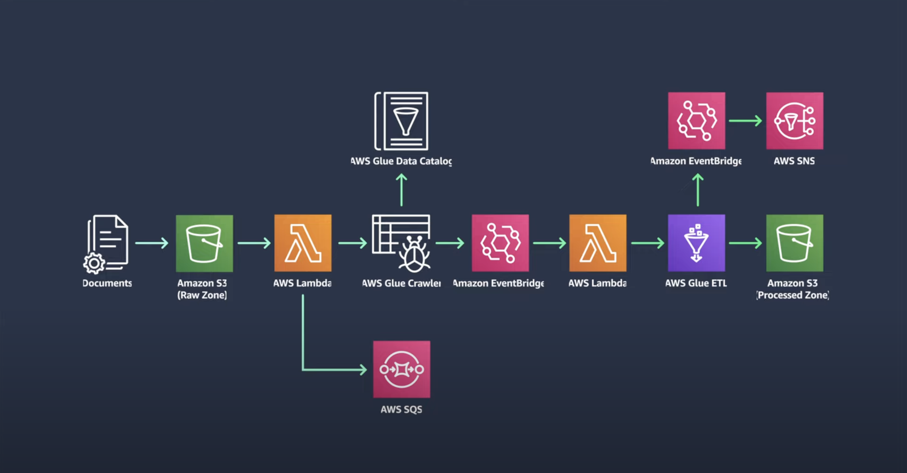

# AWS ETL Pipeline (Serverless)

## Project Overview
A serverless ETL pipeline built with AWS services and Terraform Infrastructure as Code (IaC). This pipeline leverages Amazon S3, AWS Lambda, AWS Glue, EventBridge, and SNS to automate data ingestion, processing, notifications, and loading of processed data.

## Screenshot

## Table of Contents
- [Goals & MVP](#goals--MVP)
- [Tech Stack](#tech-stack)
- [How To Use](#how-to-use)
- [Design Goals](#design-goals)
- [Project Features](#project-features)
- [Additions & Improvements](#additions--improvements)
- [Learning Highlights](#learning-highlights)
- [Known Issues](#known-issues)
- [Challenges](#challenges)

## Goals & MVP
The goal of this project is to create a scalable and automated ETL pipeline that can handle raw data ingestion, metadata extraction, transformation, and loading of processed data into structured storage. By automating this workflow using AWS Glue, Lambda, and EventBridge, this ETL process becomes efficient, fault-tolerant, and easy to monitor.

## Tech Stack
- AWS S3
- AWS Lambda
- AWS Glue
- AWS Glue Data Catalog
- Amazon EventBridge
- AWS SNS
- AWS SQS
- Terraform
- Python (Boto3)

## How To Use
1. Upload raw data files to the S3 Raw Zone bucket to trigger the ETL pipeline automatically.
2. The AWS Lambda function initiates the Glue Crawler to catalog metadata and the ETL job to process data.
3. Processed data is stored in the S3 Processed Zone bucket, and a notification is sent via SNS to notify subscribers.

## Design Goals
- **Scalability**: Design the ETL pipeline to scale as data volumes increase.
- **Fault Tolerance**: Use SQS and event-driven architecture to handle failures gracefully.
- **Cost-Efficiency**: Leverage serverless resources to minimize costs for idle time.
- **Automation**: Build a fully automated pipeline that requires minimal manual intervention.

## Project Features
- [x] Automated ingestion of raw data and schema discovery with Glue Crawler
- [x] Serverless data transformation with Glue ETL
- [x] Notifications sent to subscribers upon job completion
- [x] Decoupled messaging using AWS SQS for reliability
- [x] Infrastructure provisioned using Terraform for easy setup and teardown

## Additions & Improvements
- [ ] Implement data quality checks within the ETL process.
- [ ] Add support for data versioning in the S3 Processed Zone.
- [ ] Integrate CloudWatch for enhanced logging and monitoring of ETL jobs.
- [ ] Add support for multiple data formats (e.g., CSV, Parquet) and dynamic schema handling.

## Learning Highlights
- Using modular steps to build more complex cloud infrastructure
- Setting up and configuring AWS Glue for ETL tasks
- Using Terraform to provision AWS resources and automate IaC
- Implementing event-driven architectures with EventBridge and SQS
- Learning to manage IAM roles and permissions for AWS resources

## Known Issues
- Potential race conditions if multiple files are uploaded simultaneously, as the Glue Crawler can only process one job at a time.
- Lambda functions may timeout for very large files, requiring adjustments in timeout settings and memory allocation.

## Challenges
- Defining glue_etl_script.py to execute desired functionality 
- Careful IAM permission provisioning
- Defining process driven lambda functions 

## Contact Me
- Visit my [LinkedIn](https://www.linkedin.com/in/obj809/) for more details.
- Check out my [GitHub](https://github.com/cyberforge1) for more projects.
- Or send me an email at obj809@gmail.com
 
Thanks for your interest in this project. Feel free to reach out with any thoughts or questions.
 
 
Oliver Jenkins © 2024
